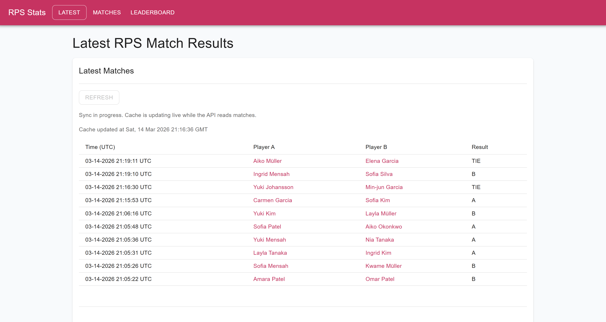
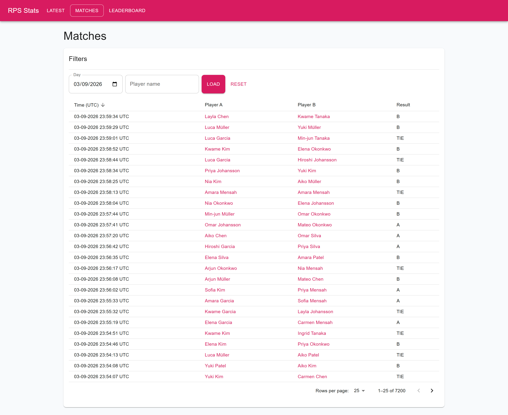
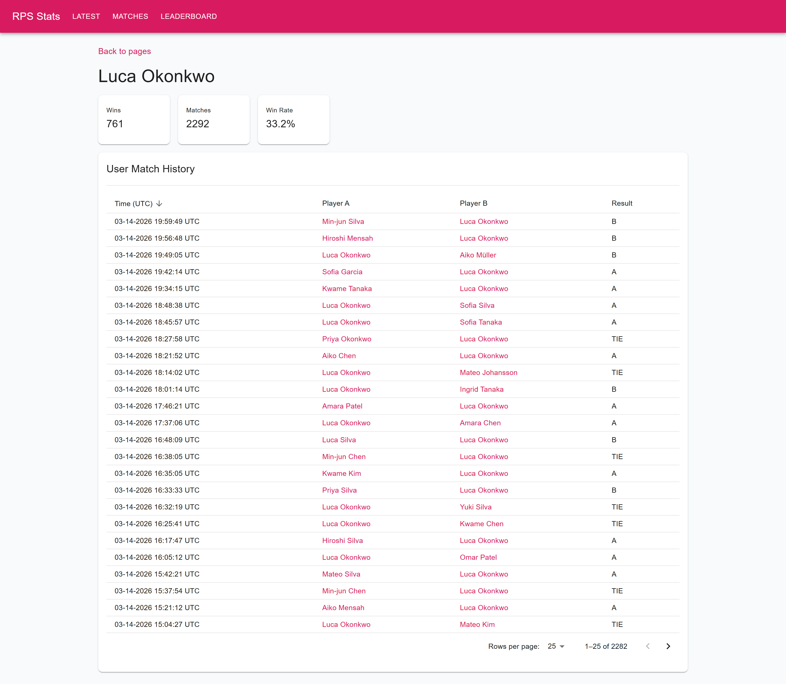
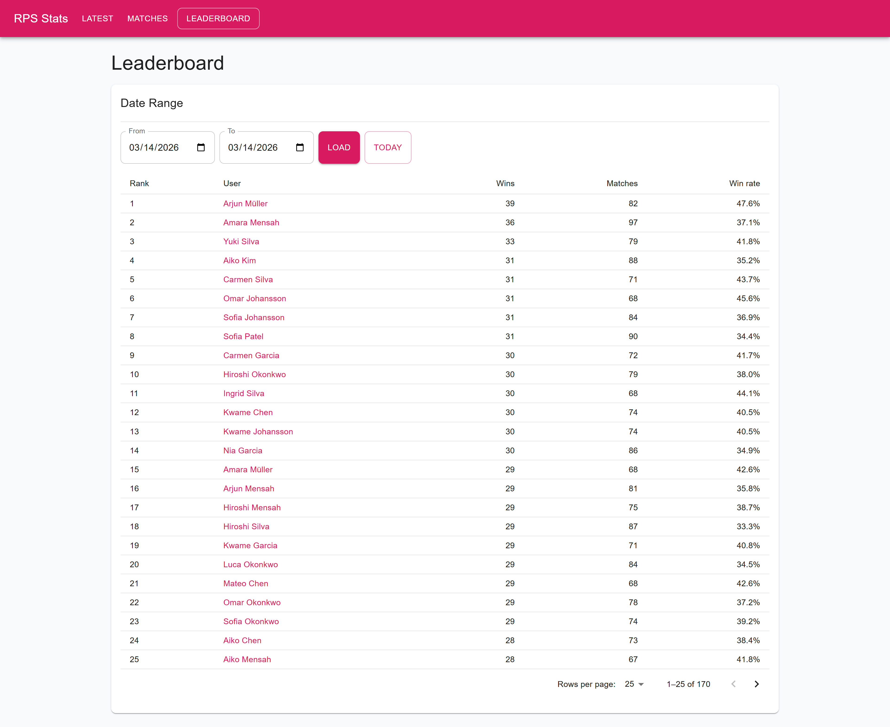
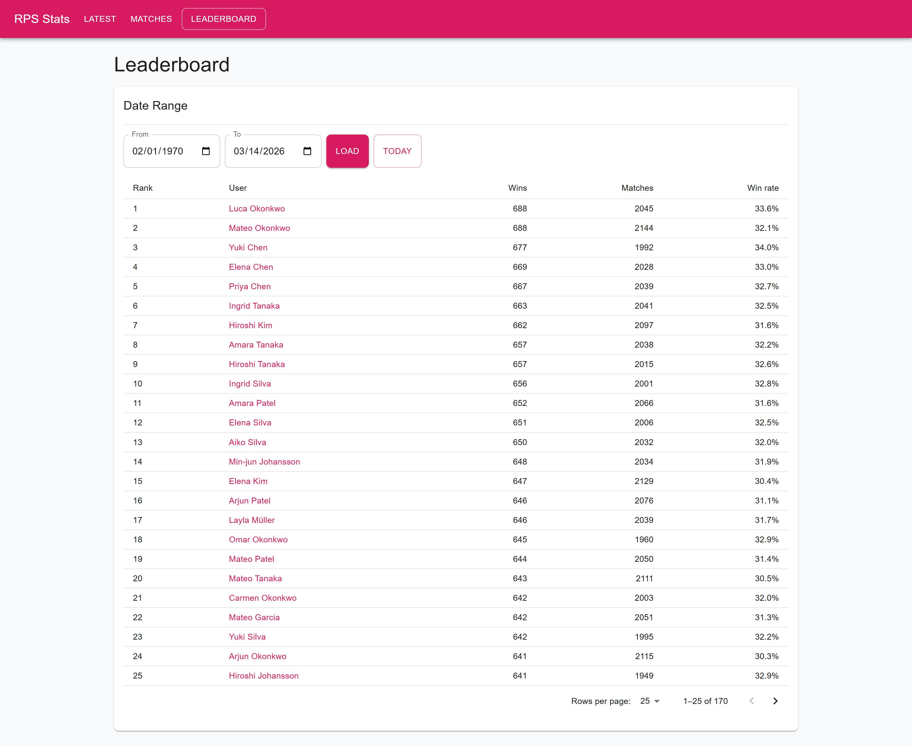
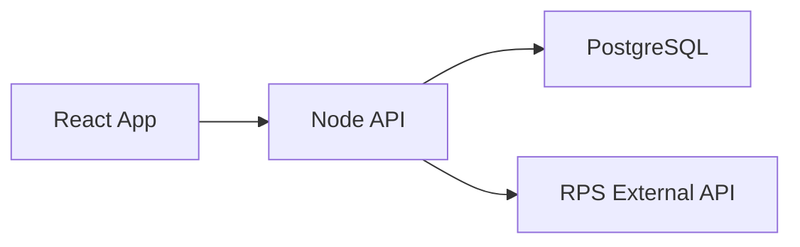

# Rock-Paper-Scissors (RPS) Statistics Project

CI status: 

Production: [https://rps.vmel.dev](https://rps.vmel.dev)

## Requested Features 

- Viewing the latest RPS match results

- Viewing the RPS match results on a given day

- Viewing match results for a specific player

- Today’s leaderboard of players based on number of wins

- Historical leaderboard based on number of wins, which shows the results for a specific date range

## Screenshots

### Latest Match Results

### Match Results by Date

### Match Results by Player

### Today's Leaderboard

### Historical Leaderboard

## Context

- Protected external API: `https://assignments.reaktor.com/`.
- API routes:
  - `/history`: paginated historical data with a pointer to the next page.
  - `/live`: live match events delivered via Server-Sent Events (SSE).
- Delivery window: `2026-03-09 09:00` to `2026-03-15 23:59`.
- Preferred implementation stack: TypeScript, React, Node.js (learning-focused project).

## Objectives & Success Criteria

### Delivery Objectives

1. Implement all required features.
   - Success criterion: each requested feature is available in the UI and backed by API endpoints.
2. Deliver production-ready MVP quality within the time limit.
   - Success criterion: stable data sync, predictable API behavior, and documented interfaces.
3. Deploy a publicly accessible application.
   - Success criterion: live environment is reachable and serves both app and API.

### Learning Objectives

1. Deepen practical proficiency in the JavaScript/TypeScript stack.
   - Success criterion: key implementation decisions are understood and reproducible without copy-paste.
2. Identify weak areas and convert them into a follow-up practice plan.
   - Success criterion: concrete backlog of topics and exercises created after delivery.

## Architecture Decisions

- Node.js + Express for back-end services: sufficient complexity/performance tradeoff for MVP scope.
- React for front-end UI: appropriate for client-rendered application without SEO/SSR requirements.
- TypeScript across layers: enforces type safety and reduces integration errors.
- PostgreSQL as primary data store: relational model matches leaderboard and historical query needs.
- OpenAPI/Swagger documentation: enables deterministic FE-BE integration and faster debugging.
- Optional (non-blocking) enhancement: Redis caching for hot leaderboard queries if time permits.

## Service scheme 

## Delivery Plan

### Phase 1: Discovery

- Validate `/history` payload shape, pagination, and cursor behavior.
- Validate `/live` event schema and ingestion expectations.
- Outcome: integration contract and normalized internal data model.

### Phase 2: Backend

- Implement full historical backfill and incremental sync strategy.
- Schedule hourly `/history` synchronization with retry policy.
- Persist sync state (cursor/checkpoint) in database for crash-safe recovery.
- Design schema and indexes for date, player, and leaderboard queries.
- Publish OpenAPI docs for all consumer-facing endpoints.
- Outcome: production-ready MVP API with reliable synchronization and recoverability.

### Phase 3: Frontend

- Implement responsive UI for latest results, date filter, player filter, and leaderboards.
- Use a component library to accelerate delivery while keeping UX consistent.
- Outcome: complete feature coverage with clear, usable presentation.

### Phase 4: Quality

- Add unit tests for core business logic and integration tests for critical API flows.
- Validate edge cases around pagination, empty states, and date-range queries.
- Outcome: regression protection for core requirements.

### Phase 5: Release

- Prepare containerized deployment artifacts and runtime configuration.
- Execute release checklist and verify health in live environment.
- Outcome: reproducible deployment process and verified production baseline.

## Release Strategy

### Must Have

- VPS deployment with Dockerized services.
- Nginx reverse proxy in front of the API/application.
- HTTPS enabled via SSL certificate.
- Public subdomain routing to the deployed environment.

### If Time Allows

- CI/CD pipeline for automated build, test, and deployment.
- Additional operational hardening and observability improvements.

## AI Assistance Policy

- AI tools are used to accelerate drafting, exploration, and implementation.
- All AI-generated output is manually reviewed before acceptance.
- Final responsibility for architecture, correctness, and security remains with the project author.
- Unclear AI-generated patterns are documented and added to the learning backlog.
